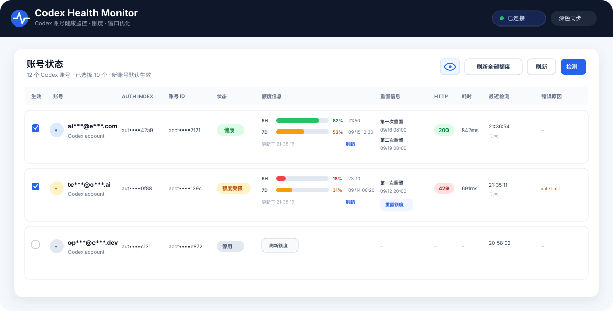
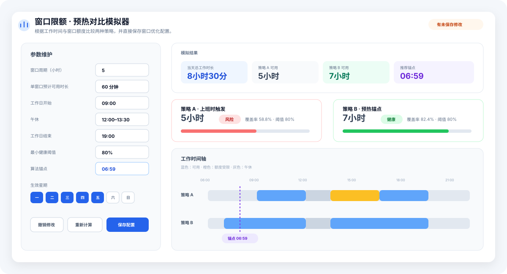
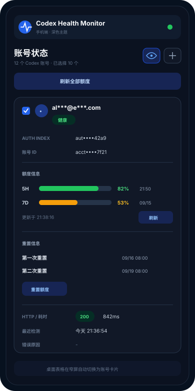

# Codex Health Monitor

> 为 CLIProxyAPI / CPA 提供 Codex 凭证独立健康检测、额度查询、重置额度、检测历史和窗口优化调度的一体化管理插件。

[](https://github.com/tapaixx/codex-health-monitor/releases/latest)
[](https://github.com/tapaixx/codex-health-monitor/actions/workflows/ci.yml)
[](#安装)
[](LICENSE)

**Codex Health Monitor** 是一个原生 Go 动态库插件。它不依赖浏览器扩展，不接管 CPA 的凭证生命周期，而是通过 CPA 插件 ABI 和 Management API 对每个 Codex 凭证进行独立探测，并提供一个内嵌管理面板。

它适合需要同时维护多个 Codex 账号、希望快速知道“哪个账号真的可用、哪个账号额度不足、下一次窗口什么时候恢复”的 CPA 部署。

## UI 预览

> 下方 UI 根据当前面板结构生成，用于 README 展示。账号、额度、时间和状态均为示例数据。

### 账号状态与额度



账号表同时展示健康状态、`auth_index`、账号 ID、额度窗口、重置次数、HTTP 状态、耗时和最近检测时间。桌面端自动分配列宽，窄屏会切换为账号卡片；眼睛按钮可一键显示或隐藏敏感信息。

### 窗口优化模拟器



窗口优化页只保留模拟器本身。可以维护工作时间、窗口周期、单窗口预计可用时长、工作日、时区、健康阈值和锚点，并对策略 A / B 的覆盖率、风险和时间轴进行直观比较。

### 手机端

<p align="center">
  
</p>

手机端使用卡片布局，不需要横向拖动整张账号表；额度、重置信息和错误原因都会在单个账号卡片内纵向展开。

## 核心能力

- **独立健康检测**：按 `auth_index` 对每个 Codex 凭证单独探测，一个账号异常不会污染其他账号的结果。
- **严格完成判定**：校验 HTTP 状态、Responses/SSE 完整结束以及最终输出，避免把半截响应或异常流误判为健康。
- **额度查询**：通过 CPA Management API 的 `/api-call` 访问 Codex 原生额度接口，识别 5H / 7D 等窗口并展示剩余额度和重置时间。
- **额度 Runtime 缓存**：额度快照保存在插件 Runtime 内存，同一 CPA 实例的多个浏览器和设备共享；页面刷新不会丢，CPA/插件重启后自然清空。
- **无后台轮询**：进入面板时只读取一次插件额度缓存；只有手动刷新单账号、刷新全部或重置额度时才访问上游。
- **重置次数**：可用 reset credits 按过期时间排序，显示“第一次重置 / 第二次重置 …”，并支持直接消耗一次重置额度。
- **窗口优化模拟器**：根据工作时间、午休、窗口周期和预计可用时长模拟策略覆盖率，给出推荐锚点和时间轴。
- **健康阈值提示**：最小健康阈值只负责模拟器中的“健康 / 风险”评价，不改变实际锚点算法和调度行为。
- **三种调度模式**：支持 `interval`、`daily_times` 和 `window_optimized`。
- **异常补偿**：窗口优化调度遇到额度受限或瞬态失败时，可在约 5 分钟后执行一次补偿检测。
- **响应式面板**：桌面端自适应列宽，1100px 以下账号表转卡片，手机端无需横向滚动整表。
- **主题同步**：跟随 CLIProxyAPI 管理中心的浅色、纯白、深色和系统主题。
- **隐私脱敏**：默认隐藏邮箱、Auth index、账号 ID，以及通知/错误信息中的常见敏感标识；眼睛按钮可在当前浏览器会话中切换显示状态。
- **历史记录**：保留最近运行记录并按账号分页展示，便于追踪失败类型和恢复过程。

## 工作方式

```text
CLIProxyAPI / CPA
├─ Codex credentials
├─ Management API
└─ Codex Health Monitor (.so)
   ├─ 独立健康探测
   ├─ Runtime 额度缓存
   ├─ 自动调度 / 窗口优化
   ├─ 检测历史
   └─ 内嵌 Web Panel
        ├─ 桌面 / 手机自适应
        ├─ 主题同步
        └─ 隐私脱敏
```

插件只读取完成探测和额度查询所需的数据。访问令牌不会写入状态文件、检测历史、面板响应或插件日志。

## 安装

### 前置条件

- Linux `amd64` 或 `arm64` 主机。
- 已运行支持标准动态库插件的 CLIProxyAPI / CPA。
- CPA 已配置至少一个 Codex 凭证。
- Management API 已启用，即 `remote-management.secret-key` 非空。

### 方式一：使用 Release 产物

从 [Releases](https://github.com/tapaixx/codex-health-monitor/releases/latest) 下载与主机架构匹配的文件：

```text
codex-health-monitor-linux-amd64.so
codex-health-monitor-linux-arm64.so
```

例如 CPA 安装在 `/opt/cli-proxy-api`，`plugins.dir` 使用默认值 `plugins`：

```bash
sudo install -D -m 0755 codex-health-monitor-linux-amd64.so \
  /opt/cli-proxy-api/plugins/linux/amd64/codex-health-monitor.so
```

arm64 主机对应安装到：

```text
/opt/cli-proxy-api/plugins/linux/arm64/codex-health-monitor.so
```

最小配置示例：

```yaml
plugins:
  enabled: true
  dir: "plugins"
  configs:
    codex-health-monitor:
      enabled: true
```

然后重启 CPA：

```bash
sudo systemctl restart cli-proxy-api
```

进入 CPA 管理中心的插件列表，打开 **Codex Health Monitor**。也可以直接访问：

```text
http://<CPA_HOST>:8317/v0/resource/plugins/codex-health-monitor/panel
```

### 方式二：CLIProxyAPI 插件源

仓库发布流程同时生成插件商店兼容资产：

```text
codex-health-monitor_<version>_linux_amd64.zip
codex-health-monitor_<version>_linux_arm64.zip
checksums.txt
```

ZIP 根目录直接包含：

```text
codex-health-monitor.so
```

因此自定义插件源只需要让条目的 `repository` 指向：

```text
https://github.com/tapaixx/codex-health-monitor
```

CPA 会读取 latest Release，并按当前平台选择对应 ZIP。

### Docker 部署

把配置和插件目录挂载到 CPA 容器：

```yaml
services:
  cli-proxy-api:
    image: router-for-me/cli-proxy-api:latest
    volumes:
      - ./config.yaml:/CLIProxyAPI/config.yaml
      - ./plugins:/CLIProxyAPI/plugins
```

宿主机目录示例：

```text
plugins/
└── linux/
    ├── amd64/
    │   └── codex-health-monitor.so
    └── arm64/
        └── codex-health-monitor.so
```

## 面板说明

### 账号状态

账号状态是日常使用的主视图。每个账号可以看到：

| 信息 | 说明 |
| --- | --- |
| 生效 | 是否参与自动检测和窗口优化计划 |
| 账号 | Codex 邮箱，默认脱敏 |
| Auth index | CPA 凭证索引，默认脱敏 |
| 账号 ID | `Chatgpt-Account-Id`，默认脱敏 |
| 状态 | 健康、额度受限、未授权、超时、响应异常、停用等 |
| 额度信息 | 5H / 7D 剩余百分比、窗口重置时间、最后成功更新时间 |
| 重置信息 | 第一次、第二次等可用 reset credit 及过期时间 |
| HTTP / 耗时 | 最近一次健康检测结果 |
| 最近检测 | 最近一次独立探测时间 |
| 错误原因 | 标准化后的失败信息 |

“刷新全部额度”由插件端并发处理。单个账号失败或超时不会无限拖住其他账号；已有成功额度快照会继续保留，并显示刷新失败状态。

### 额度缓存

额度数据的生命周期是：

```text
手动查询额度
      ↓
Plugin Runtime 内存
      ↓
GET /quota
      ↓
任意浏览器 / 手机进入面板时读取
```

这意味着：

- 浏览器刷新不会丢额度。
- 同一 CPA 实例的多个客户端可以看到相同快照。
- 面板不会为了“多端同步”而持续轮询。
- CPA 或插件进程重启后额度缓存清空，下一次手动刷新重新获取真实数据。

### 窗口优化

`window_optimized` 模式使用模拟器管理窗口参数。默认值为：

| 参数 | 默认值 |
| --- | --- |
| 窗口周期 | `5` 小时 |
| 单窗口预计可用时长 | `60` 分钟 |
| 工作时间 | `09:00–19:00` |
| 午休 | `12:00–13:30` |
| 生效星期 | 周一到周五 |
| 时区 | `Asia/Shanghai` |
| 算法锚点 | `06:59` |
| 最小健康阈值 | `80%` |

窗口优化账号的实际执行点会在计划时间上增加 **0–3 分钟**随机错峰，避免多个账号同时打到上游。额度受限或瞬态失败可在约 **5 分钟**后补偿一次。

最小健康阈值只用于模拟器风险提示：

```text
覆盖率 >= 阈值  →  健康
覆盖率 <  阈值  →  风险
```

它不会参与推荐锚点计算，也不会直接改变实际调度。

### 隐私与安全

面板默认开启敏感信息脱敏。眼睛按钮可以切换显示/隐藏，并将状态保存在当前浏览器的 `sessionStorage` 中。

脱敏覆盖：

- 邮箱
- `auth_index`
- account ID
- 检测历史中的账号标识
- 错误提示、额度错误和通知中可识别的邮箱 / UUID / 常见账号或请求 ID

插件不会自动删除、停用或刷新 CPA 凭证。

## 健康判定

一个账号只有同时满足以下条件才会标记为健康：

1. 上游返回 HTTP 2xx。
2. Responses/SSE 流完整结束，并出现完成事件。
3. 最终响应符合插件预期的最小探测结果。

常见失败会被分类为未授权、额度异常、限流、超时、网络错误和上游响应异常等状态。

## Management API

插件注册以下管理接口：

```text
GET  /v0/management/plugins/codex-health-monitor/status
GET  /v0/management/plugins/codex-health-monitor/accounts
GET  /v0/management/plugins/codex-health-monitor/history
POST /v0/management/plugins/codex-health-monitor/run
GET  /v0/management/plugins/codex-health-monitor/schedule
POST /v0/management/plugins/codex-health-monitor/schedule
GET  /v0/management/plugins/codex-health-monitor/quota
POST /v0/management/plugins/codex-health-monitor/quota/refresh
POST /v0/management/plugins/codex-health-monitor/quota/refresh-all
POST /v0/management/plugins/codex-health-monitor/quota/reset
```

所有 Management API 请求都由 CPA 的管理鉴权保护。

## 从源码构建

默认使用 Docker 中的 Go 工具链构建：

```bash
git clone https://github.com/tapaixx/codex-health-monitor.git
cd codex-health-monitor
chmod +x build.sh
ARCH=amd64 ./build.sh
```

构建 arm64：

```bash
ARCH=arm64 ./build.sh
```

普通开发测试：

```bash
go test ./...
go test -race ./...
go vet ./...
node --test panel_test.mjs
```

发布工作流会构建 Linux amd64 / arm64，并生成裸 `.so`、插件商店 ZIP、`.sha256` 和 `checksums.txt`。

## 数据与持久化

- **调度配置 / 窗口优化状态**：写入插件数据目录中的 `window-optimizer.json`，CPA 重启后保留。
- **检测历史**：由插件状态持久化逻辑维护。
- **额度快照**：仅保存在插件 Runtime 内存，不写磁盘。
- **浏览器隐私开关**：仅保存在当前会话的 `sessionStorage`。

## 升级

推荐直接安装 latest Release。手动升级时先停止 CPA，替换 `codex-health-monitor.so` 后重新启动。

发布页：<https://github.com/tapaixx/codex-health-monitor/releases>

## License

MIT
